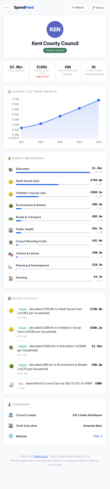

# SpendFeed

Track how every English council spends your money — a Venmo-inspired dashboard for local government finance.



**317 councils · Zero backend · Free and open data**

## How it works

1. Pick your council from the search dropdown
2. See a full breakdown: tax history, budget by category, per-household estimates, and recent activity
3. Star councils to watch them

Data sourced from [CivAccount](https://www.civaccount.co.uk), licensed under the [Open Government Licence v3.0](https://www.nationalarchives.gov.uk/doc/open-government-licence/version/3/).

## Run locally

```bash
open index.html
```

Or serve with any static server:

```bash
python3 -m http.server 8080
```

## Update data

```bash
./fetch_all_councils.py      # Re-download all 317 councils from the API (~7 min)
./build_council_data.py       # Rebuild dashboard files from raw data
```

## Deploy

Push to GitHub and enable Pages from the `/docs` folder.

## License

Code: [MIT](LICENSE) · Data: [Open Government Licence v3.0](https://www.nationalarchives.gov.uk/doc/open-government-licence/version/3/)
